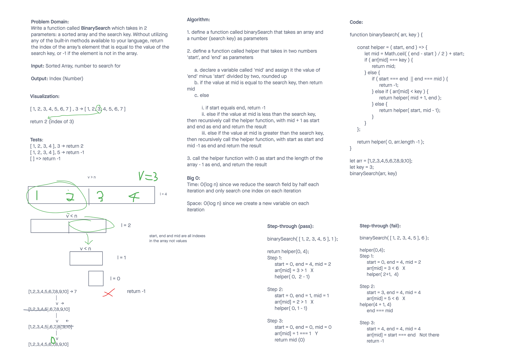

# Code Challenge 03

## Array Binary Search

[Invision Freehand](https://projects.invisionapp.com/freehand/document/afYIl4V4n?)

## Approach & Efficiency

### Approach

We used recursion to repeatedly perform the search on a smaller portion of the array by checking if the value at the midpoint of the array is bigger, smaller, or equal to the search key.

### Efficiency

- This runs in O(log n) time and uses O(log n) space (??? maybe O(1) space)
