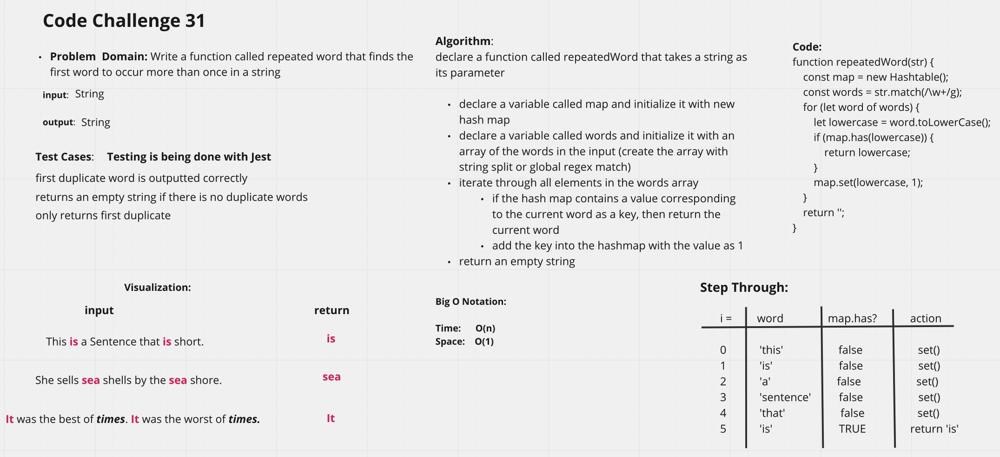
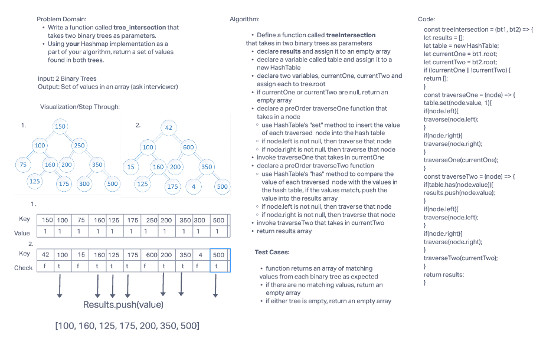
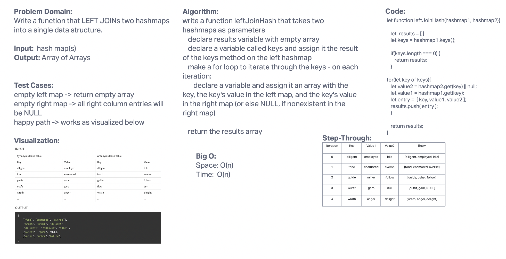

# Code Challenge 30-32

## Hashmap

### Problem Domain

#### Challenge 30

Implement a hashmap with methods:

- get(key)
- set(key, value)
- has(key)
- keys()

#### Challenge 31

Write a function that uses a hashmap to find and return the first repeated word in a string

#### Challenge 32

Write a function that uses a hashmap to return a list of repeated values between two binary trees.

#### Challenge 33

Write a function that takes two hashmaps and returns a LEFT JOIN of the two maps

### Testing

- `npm test hashmap`
