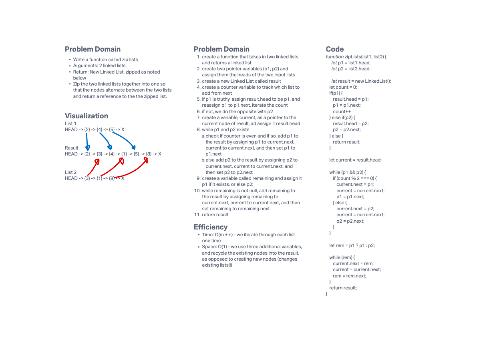

# Challenge Summary

- This challenge was to implement a singly linked list with methods for insertion and search.

## Whiteboard Process

### Challenge 8 (zip)

## Approach & Efficiency

### Approach

- The central mechanism for most implementation details is using a while loop to iterate through the nodes of the linked list until a certain criteria is met, or null is encountered. At that point, either return, throw an error, or perform some action.

- For kth from the end, I simply iterated twice. The first iteration determines the length of the list, and the second iterates a counter until it reaches the target index, determined from the length - 1 - k.

### Efficiency

| Function | Time Complexity | Space Complexity |
| --- | --- | --- |
| append | O(n) | O(1) |
| insertBefore | O(n) | O(1) |
| insertAfter | O(n) | O(1) |
| findAtIndex | O(n) | O(1) |
| findFromEnd | O(n) | O(1) |
| includes | O(n) | O(1) |
| zipLists | O(n) | O(1) |

## Solution

- All of the implementation code exists in index.js
- Run the tests by running `npm test linked-list`
