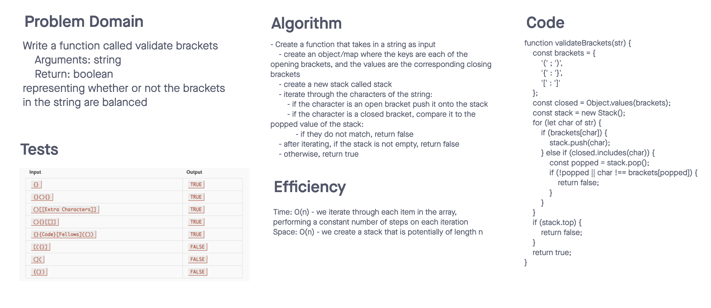

# Challenge Summary

- Write a function called validate brackets
  - Arguments: string
  - Return: boolean

- representing whether or not the brackets in the string are balanced

## Whiteboard Process

- 

## Approach & Efficiency

- Create a map to associate corresponding brackets
- everytime we encounter an open bracket, push it onto the stack
- every time we encounter a closed bracket, check that it corresponds with the top value in the stack (early return if not)
- if after iterating, anything is remaining on the stack, return false
- if all of the above passed, return true

### Efficiency

- Time: O(n) - iterate through all elements of the input
- Space: O(n) - create a new stack of potentialy length n

## Solution

- All of the implementation code exists in stack.js and queue.js
- Run the tests by running `npm test queue` or `npm test stack`
