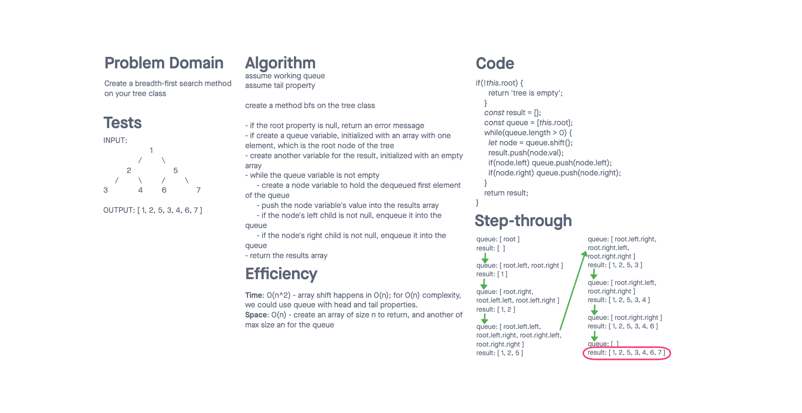

# Challenge Summary

- This challenge was to implement a binary tree that can perform in-order, pre-order, and post-order traversal
- Then create a binary search tree that extends the existing binary tree and has methods to add a new value into the tree and to check if a given value exists in the tree.

## Whiteboard Process

- 
- 

## Approach & Efficiency

- For the standard binary tree, all traversal are almost identical, with the exception of the ordering of pushing the current value and traversing the children.
  - Pre-order: current, left, right
  - In-order: left, current, right
  - Pre-order: left, right, current

- For the binary search tree, add goes left if the value is smaller than that of the current node, right if otherwise
- if the child is null, we insert a new node with the given value at that position
- Note that for this, I assumed no duplicate values allowed and the given value does not already exist.
- For contains, we return true if the given value and current node's value are equal, false if null, and return the value of the recursive call to the left or right child if less/greater than the current node's value
- For findMax, we use a base case of node being null in our recursion and then return the max of the current node's value, and the return of the traverse function on its left and right children
- For BFS, we use a queue to store the children of every node as it is removed from the queue, allowing us to maintain a correct level-order traversal.  Since I used an array to represent my queue (for simplicity) the time complexity works out to be O(n^2), since `array.prototype.shift()` happens in O(n)

### Queue

| Function | Time Complexity | Space Complexity |
| --- | --- | --- |
| traversal | O(n) | O(n) |
| add | O(h) | O(1) |
| contains | O(h) | O(1) |
| findMax | O(n) | O(1) |
| bfs | O(n^2) | O(n) |

## Solution

- All new implementation code exists in index.js.
- Run the tests by running `npm test trees`
